## いろんな地図(MapApp) - 地図表示

旧版のMapAppを新しい開発環境(Android Studio Narwhal)で再作成。  
大きな変更はGPSデータファイルなどを共通ストレージ(/strage/emulated/0/DCIM/mapapp)に変更、あと細かいところを修正。  

### 機能
・国土地理院の地図データなどをいろいろな地図を表示する  
・GPSデータを取得して異動した経路を表示する  
・GPSのトレースデータを一覧で管理する  
・GPSのトレースデータをタイトルやコメントなど情報をつけてかんりする  
・GPSトレースデータを速度/距離、標高/距離などのグラフ表示をする  
・GPSのトレースデータをGPXファイルとして出力できる  
・他のGPXファイルのデータを地図上に表示する  

### 起動画面
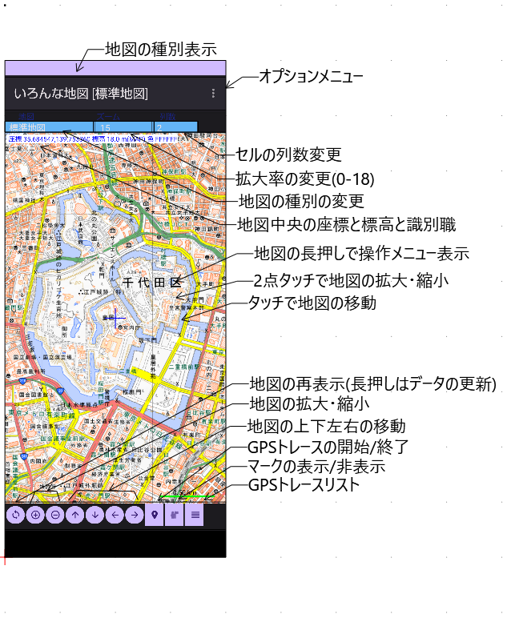

**上部選択リスト** : グループ名と記録中のGPXファイル名が表示される  
**下部ボタン** : 目的地をリスト表示、選択した目的地の方向と距離を表示  

#### オプションメニュー
**地図情報** : 現在地をグーグルマップで開く  
**GPSトレースリスト** :  
**マーク操作** : 目的地をグーグルマップで開く  
**写真の位置** : 設定画面を開く  
**地図データ一括取込み** : 
**地図データ編集** : 
**アプリ情報** :    

### 目的地リスト選択
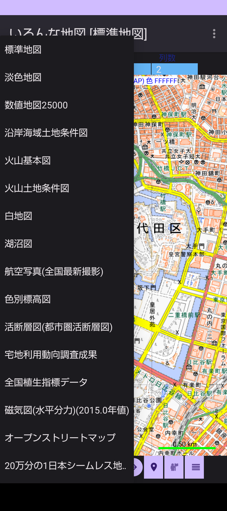

### 標準地図
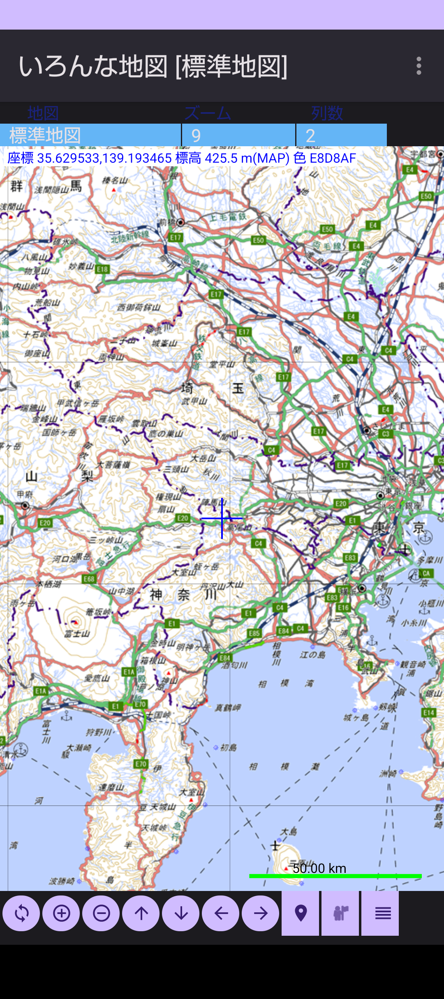

### 色別標高図

### 航空写真地図
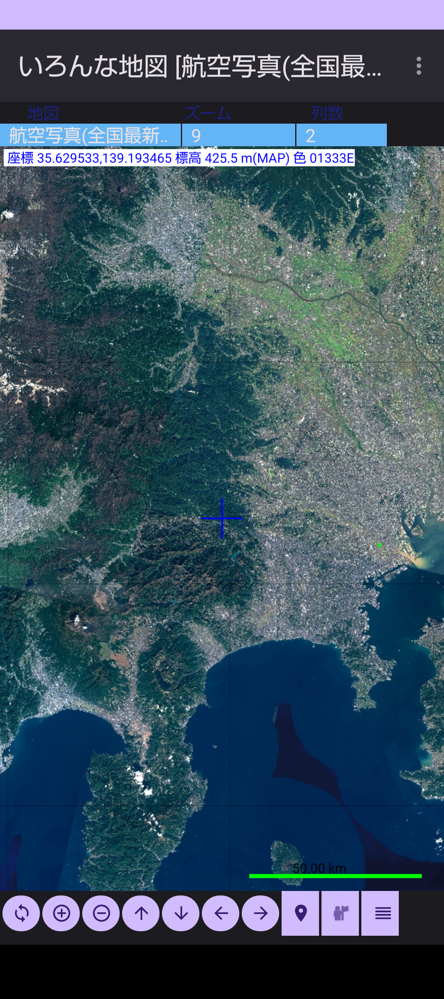

### 気象庁の雨雲の動きと白地図の重ね合わせ
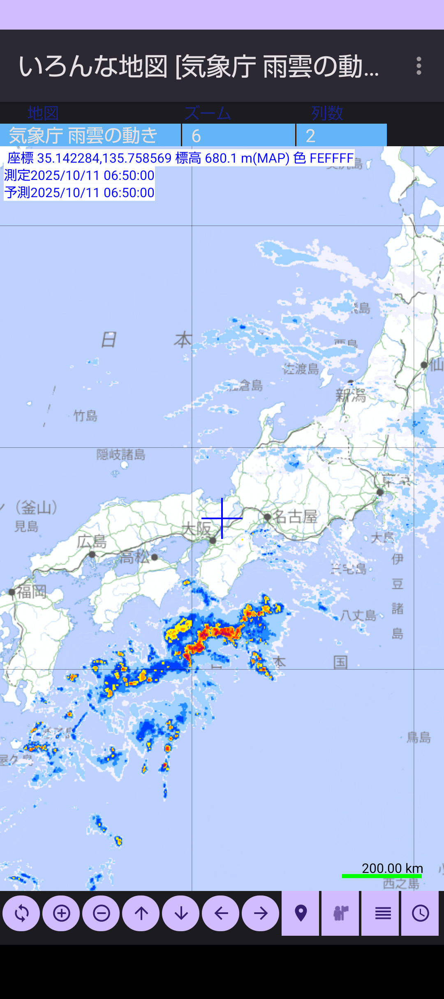

### 20万分の1日本シームレス地質図
凡例ファイル(data/legend_seamless_v2.csv)を内部ストレージのDCIM/MapAppのフォルダに入れると地質名が表示できる  
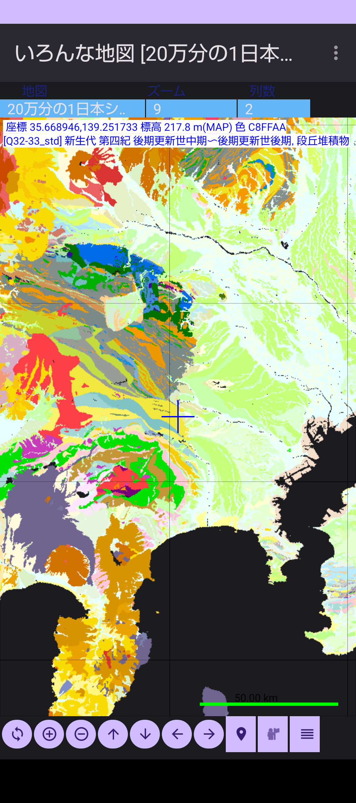

### 地図データの設定編集
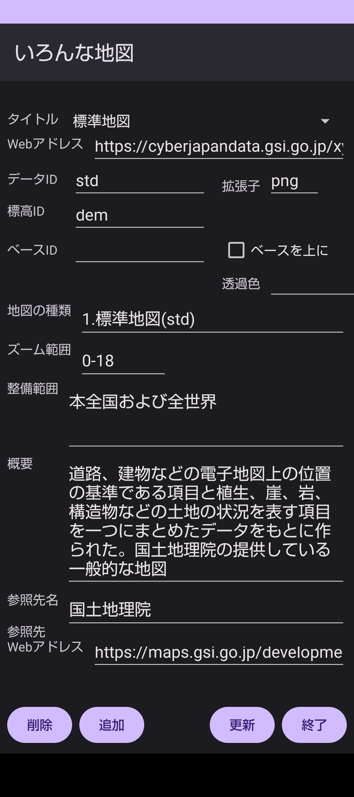
  
### GPSのトレース表示
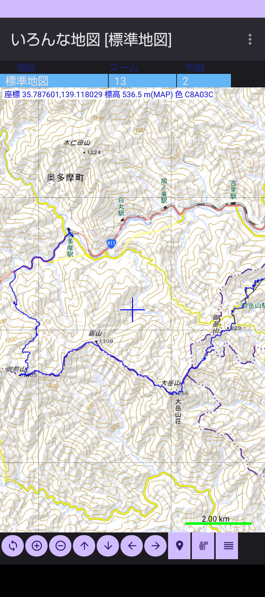

### GPSトレースリスト
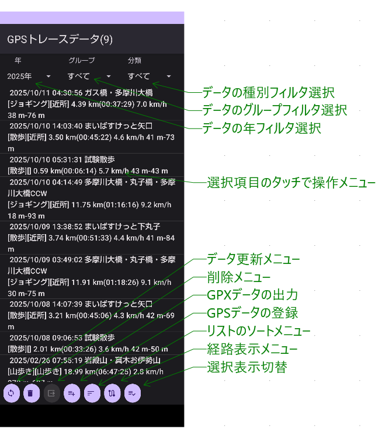

### GPSトレースリストの操作メニュー
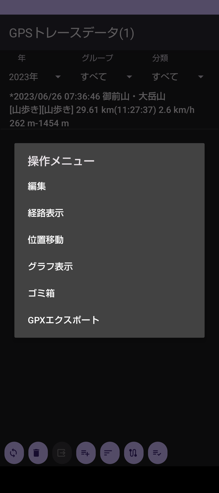

### GPSトレースファイルの登録編集
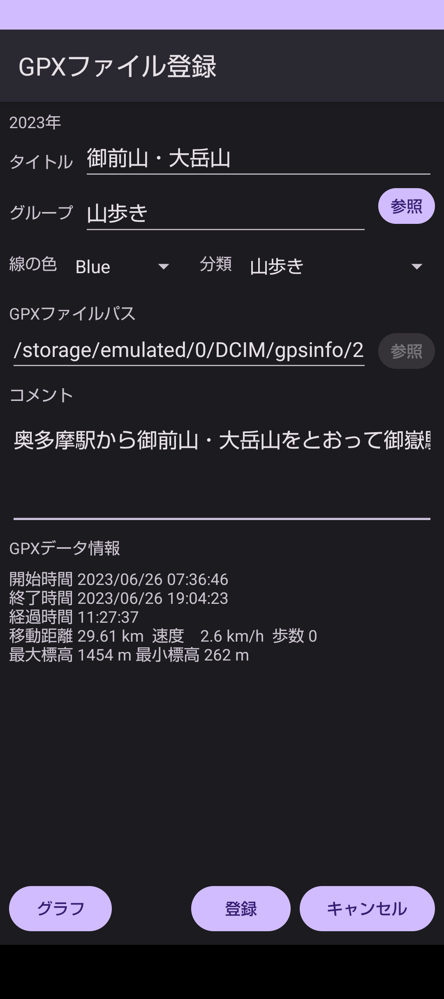

### GPSトレースデータのグラフ表示
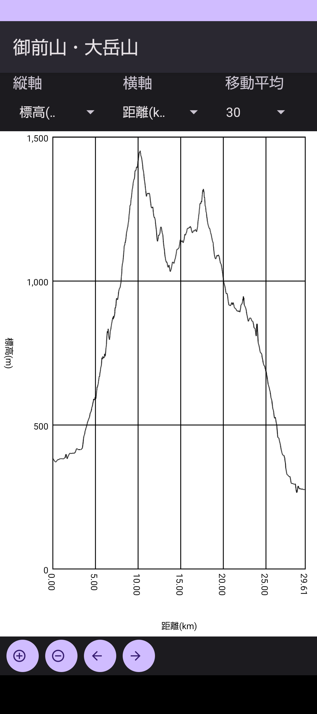

### マークデータの編集画面
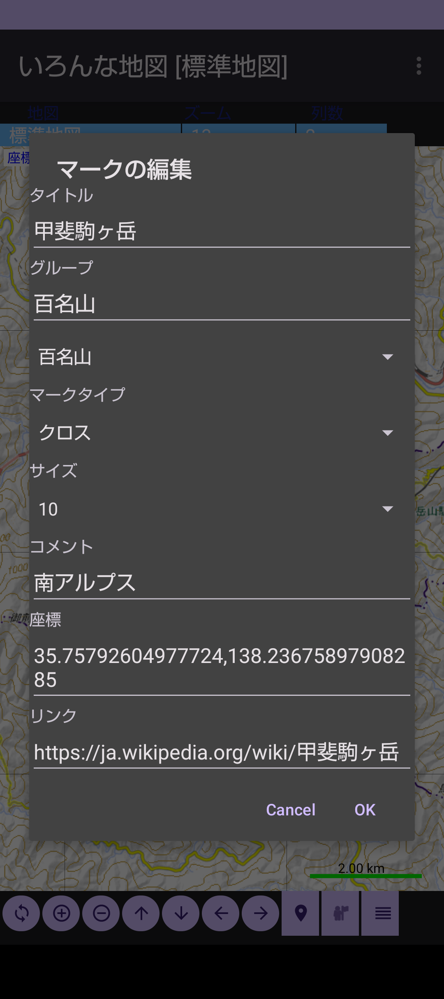

#### インストール方法
実行ファイルのダウンロードは[mapapp-debug.apk](mapapp-debug.apk)をダウンロードする。  

・スマホを開発者オプションの設定にする(Android12/13)  
1.	スマホの設定アプリを開く
2.	デバイス情報 (端末情報)をタップ
3.	下のほうに「ビルド番号」という項目があるので、10回程度タップする
4.	設定アプリの最初に戻って「システム」をタップ
5.	「開発者向けオプション」が表示されるのでタップ
6.	一番上の「開発者向けオプションの使用」をタップして開発者向けオプションを有効化する

・インストール  
Filesアプリでダウンロードしたファイル(mapapp-debug.apk)をタップするか、ファイルを選択してから右側の点をタップするとメニューが表示されるのでインストールを選択するとインストールが開始される。  

・起動時の設定  
アプリ起動時にファイルアクセスの設定が有効になっていないと「ファイルアクセス」の設定画面が開くので、そこでアプリ(いろんな地図)を選択して「全ファイルの管理権を付与」を有効にする。  
・その他のアクセス権の設定  
アンドロイドのホーム画面から「設定」を開いて「アプリ」「いろんな地図」を選択した画面で「権限」を選択して「許可しない」項目にある権限(位置情報、身体活動)を選択して権限の許可をおこなう。  
これが設定されていないとGPSトレースや歩数計測が使用できない。  

履歴  
2025/11/06 無段階の地図拡大縮小に対応、タッチ操作による地図の移動ズームに対応  
2025/11/06 地図データの一括ダウンロードを非同期処理に変更  
2025/10/15 GPSトレース開始時にBeep音追加、GPSトレースグラフに歩数を追加  
2025/09/26 Android Studio Norwhal で再作成  

### 開発環境  
Android Studio Narwhal 3 Feature Drop | 2025.1.3  
Build #AI-251.26094.121.2513.14007798, built on August 28, 2025  
Windows 11.0  
Java  
