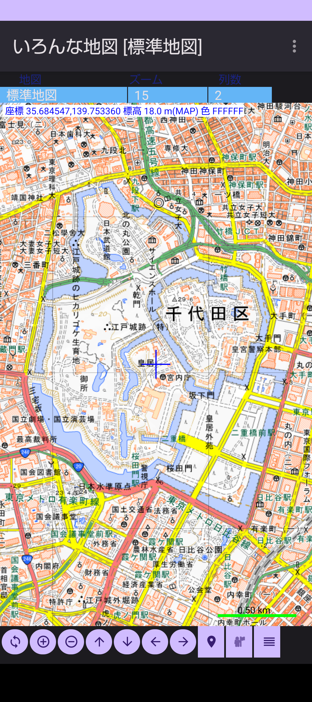

## いろんな地図(MapApp) - 地図表示

旧版のMapAppが新しい開発環境(Android Studio Narwhalで再作成。  
大きな変更はGPSデータファイルなどを共通ストレージ(/strage/emulated/0/DCIM/mapapp)に変更、あと細かいところを修正。  

### 機能
・国土地理院の地図データなどをいろいろな地図を表示する  
・GPSデータを取得して異動した経路を表示する  
・GPSのトレースデータを一覧で管理する  
・GPSのトレースデータをタイトルやコメントなど情報をつけてかんりする  
・GPSトレースデータを速度/距離、標高/距離などのグラフ表示をする  
・GPSのトレースデータをGPXファイルとして出力できる  
・他のGPXファイルのデータを地図上に表示する  

### 起動画面

**上部選択リスト** : グループ名と記録中のGPXファイル名が表示される  
**下部ボタン** : 目的地をリスト表示、選択した目的地の方向と距離を表示  

#### オプションメニュー
**地図情報** : 現在地をグーグルマップで開く  
**GPSトレースリスト** :  
**マーク操作** : 目的地をグーグルマップで開く  
**写真の位置** : 設定画面を開く  
**地図データ一括取込み** : 
**地図データ編集** : 
**アプリ情報** :    

### 目的地リスト選択

  

#### インストール方法
実行ファイルのダウンロードは[gpsinfo-debug.apk](gpsinfo-debug.apk)をダウンロードする。  

スマホを開発者オプションの設定にする(Android12/13)
1.	スマホの設定アプリを開く
2.	デバイス情報 (端末情報)をタップ
3.	下のほうに「ビルド番号」という項目があるので、10回程度タップする
4.	設定アプリの最初に戻って「システム」をタップ
5.	「開発者向けオプション」が表示されるのでタップ
6.	一番上の「開発者向けオプションの使用」をタップして開発者向けオプションを有効化する

Filesアプリでダウンロードしたファイルをタップするかファイルを選択してから右側の点をタップするとメニューが表示されるのでインストールを選択するとインストールが開始される。  

履歴  
2025/09/26 Android Studio Norwhal で再作成  

### 開発環境  
Android Studio Narwhal 3 Feature Drop | 2025.1.3  
Build #AI-251.26094.121.2513.14007798, built on August 28, 2025  
Windows 11.0  
Java  
